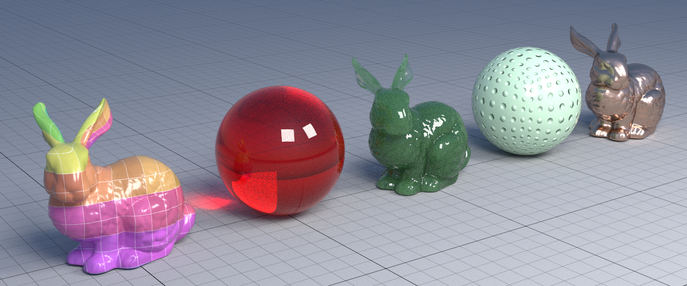
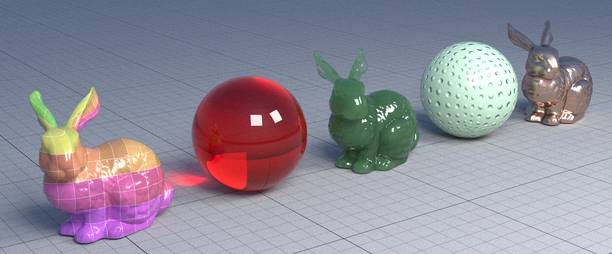
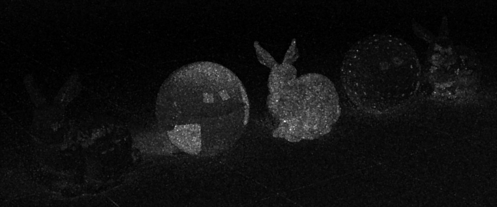
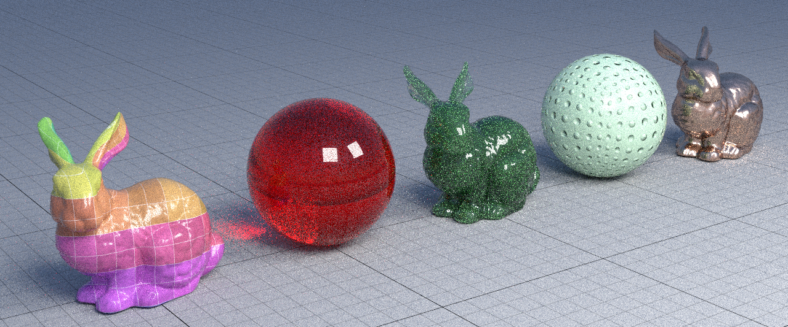

# Simple advances on Yocto/GL

This project is a simple modification to add adaptive sampling in Yocto/GL path tracer. Simply put, the integrator put samples where it is more important.

Just for comparison, take a look at the image below.

First, the 'features1' sampled with 1024 samples in the default sampler:

Now, the same image, sampled with the adaptive sampler in same time (477 seconds in my computer):

Note how better the refraction looks in the red ball. And the scattering is more smooth in the green bunny.

And here, the interesting sample density image:

The areas with 'pure black', the pixels has 32 samples. At the brightest areas, the image has more than 65k samples!

The main idea is based in  paper [A Hierarchical Automatic Stopping Condition for Monte Carlo Global Illumination](http://jo.dreggn.org/home/2009_stopping.pdf) from where I get the pixel error estimation. Basically, the samples are put around the worst pixels measured using the formula describe in the paper. (Actually, '-log2(pixel error)', since I think that 'q 3' is more meaningful than error 0.125, and is easier to understand). The process is repeated again and again until all pixels reach a specific quality, or the time limit or spp limit is reached.

## New programs

Aside a few modifications to the Yocto/GL library, all the idea is implemented in a new library called 'yocto_trace_adp' and in the program 'yscenetrace_adp'. This program has this specific options:

- '-q <float>': Sample the image up to a specific quality (see below images comparing) the quality). This may be the default option. Set the quality and forget. Pratical values are between 4-6, and, and fractional values like '4.2'. Below 3.5, the image is too noisy. Above 6, too much effort for little improvement.
- '--seconds <integer>': Sample the image for a specified time. Great for comparison with others path tracers.
- '--spp <integer>': Sample the image up to a specific sample per pixel.
- '--save-batch': This option, that already exists in original 'yscenetrace' gets a new meaning. It saves the current 'q', 'spl' and 'actual' images as the image reaches a integer quality. 'spl' and 'actual' images needs no explanation. 'q' image is what the tracer 'sees' to decide what regions needs more samples. Dark areas needs more samples. Bright areas no.

## Quality comparison

Using 'features1' image as base, see the quality increasing below. Note that de noise is nearly equal in whole image, not in specific areas.

#### -q 0

#### -q 1

#### -q 2

#### -q 3

#### -q 4

#### -q 5

#### -q 6

## Next steps

A simplified 'Gradient-Domain Path Trace', as described in section 2.3 of paper [A Survey on Gradient-Domain Rendering](https://www.google.com/url?sa=t&rct=j&q=&esrc=s&source=web&cd=2&cad=rja&uact=8&ved=2ahUKEwjUhpWvkv3oAhUIJ7kGHagfB0EQFjABegQIMBAB&url=https%3A%2F%2Fwww.researchgate.net%2Fpublication%2F333663509_A_Survey_on_Gradient-Domain_Rendering&usg=AOvVaw3iuxfB5Ijvx7fC2nvLrbmz) with some type of adaptive sampling.
